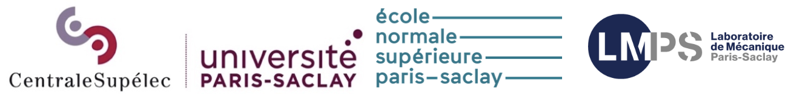

## Open positions in the MINERVE Project

### PhD positions in computational Civil and Environmental Engineering

* *Efficient computational approaches for designing new reinforced concrete rail bridges with reduced environmental impact*
    * **Keywords:** life cycle, finite element analysis, uncertainty, hazard, optimization, reinforced concrete, BIM, structural mechanics.
    * [Download offer here](http://jehelp.github.io/files/RC-bridge_eco-design_PhD.pdf)
* *Développement d’outil d’aide au diagnostic de la capacité résiduelle de structures en maçonnerie dans un contexte multi-aléas*
    * **Mots-clés :** maçonnerie, analyse de survie, multi-aléas, combinaison d’actions, modélisation multi-fidélité
    *
* *High performance machine learning and data analytics for next generation railway design*
    * **Keywords:** big data, machine learning, high performance data analytics, railway infrastructure.
    *
* ...

## Project general presentation

The project MINERVE is about designing and developing numerical methods and tools for modeling the French rail infrastructure all over its life cycle. MINERVE is leading the ongoing transition towards designing, constructing, operating, maintaining, and decommissioning rail infrastructure assets in a way that is more efficient, more reliable, and with limited negative impact on the environment. MINERVE is improving the global performance of the national rail infrastructure by adapting it to the effects of climate change and by reducing its negative impacts on the planet while increasing its competitiveness.

The project MINERVE gathers 4 industrial partners (SNCF, RATP, Colas Rail, and Kayrros), 1 private research institute (IREX), and 1 academic institution (Université Paris-Saclay). It is financially supported by the French government in the framework of the Recovery Plan and of the Investing for the Future program.

## Workplace description

The PhD candidates will be appointed in the Laboratoire de Mécanique Paris-Saclay (LMPS) at Université Paris-Saclay. The LMPS (UMR 9026, Université Paris-Saclay / CentraleSupélec / ENS Paris-Saclay / CNRS) is dedicated to research on all aspects of solid mechanics (mechanics of materials and structures, civil engineering, fine experimentation, and efficient numerical modeling). The LMPS has about 220 members, including 110 PhD students and postdocs and 35 engineers, technicians and administrative staff on two sites of Paris-Saclay University: CentraleSupélec and ENS Paris-Saclay, both in Gif-sur-Yvette.

The LMPS hosts four research teams. The PhD candidates will join the OMEIR team (Structures, Materials, Environment, Interactions, and Risks). The team contributes to the energy, ecological, and digital transitions of all fields related to cities and infrastructures. It brings together the expertise of research groups specializing in construction and natural materials, the modeling of various physical phenomena (mechanical, thermal, hydric, chemical), advanced experimentation, natural risks, large-scale and advanced numerical simulations, and statistical learning. The associated societal issues in the field of construction in the broadest sense (building, structures, public works, civil engineering, etc.) highlight essential questions related to the ecological and social impacts of human activities concerning not only the resilience of society, but also those associated with information technologies which are disrupting the practices of the sector. In this respect, three important points can be highlighted: the reduction of the ecological footprints of structures; the evaluation and reduction of the vulnerability of constructions (with economic and human impact) subject to hazards/risks, natural or otherwise; the transition from digital models to true digital twins combining multi-physics simulation, data assimilation, and advanced experiments.
