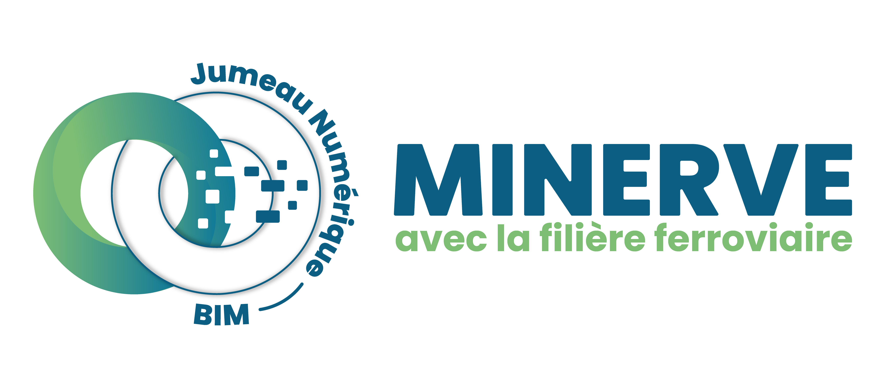
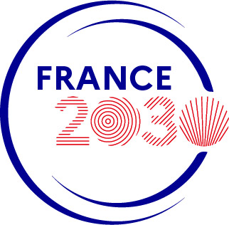

I am serving as Principal Investigator in the following research projects:
* [MINERVE project](#minerve-project)
* [GEOPONT project](#geopont-project)

I am supervising the following PhD research topics:
* [TBM monitoring](#tbm-monitoring)

### MINERVE project

The MINERVE project aims at reaching the carbone net-zero objective in the rail infrastructure sector while adapting the rail infrastructure to climate change. Collaboration and digital continuity will be developed all over the life cycle of the French rail infrastructure. The MINERVE project is about designing and developing numerical methods and tools for modeling the French rail infrastructure all over its life cycle. It is leading the ongoing transition towards designing, constructing, operating, maintaining, and decommissioning rail infrastructure assets in a way that is more efficient, more reliable, and with limited negative impact on the environment. MINERVE is improving the global performance of the national rail infrastructure by adapting it to the effects of climate change and by reducing its negative impacts on the planet while increasing its competitiveness.

A multi-disciplinary team of about 20 researchers, postdocs, and PhD candidates is working on this project at Université Paris-Saclay. As Principal Investigator for Université Paris-Saclay / CentraleSupélec, I am in charge of coordinating 2 tasks of the project and of carrying out research to i) develop algorithms and predictive numerical models to assess rail assets performance in the uncertain context of climate change, and ii) to develop a common data environment platform.

The project MINERVE is a public-private &euro;35 million-project gathering 4 industrial partners (SNCF, RATP, Colas Rail, and Kayrros), 1 private research institute (IREX), and 1 academic institution (Université Paris-Saclay). It is supported by the French government in the framework of the France 2030 investment plan.

 

[top](#top)

### GEOPONT project

The GEOPONT project gathers the expertise of 2 industrial partners (Bouygues Travaux Publics and SpotLight Earth) and of CentraleSupélec / Université Paris-Saclay to develop a methodology for the fast and affordable health monitoring of reinforced concrete bridges. Established and emerging geophysical methods are considered. As Principal Investigator and with a post-doctoral researcher under my supervision, I am in charge of i) designing simulation-informed active seismic surveys for collecting data on bridges and ii) developing field-experiment-informed numerical simulations of active seismic surveys to detect possible damage in a bridge.

The GEOPONT project is supported by the French government in the framework of the France 2030 investment plan.

[top](#top)

### Tunnel Boring Machine monitoring in urban areas

I am co-supervising the research work of a PhD candidate on controlling Tunnel Boring Machines (TBM) to minimize ground settlements in urban areas. A finite element computational model is being developed using the software Abaqus for simulating ground settlement induced by a TBM underground. Data from the TBM and from ground surface monitoring is being collected. A reinforcement learning strategy using Gaussian processes will be explored for providing optimal control of the TBM.

The work is supported by the SOCOTEC Monitoring company.

[top](#top)




  

